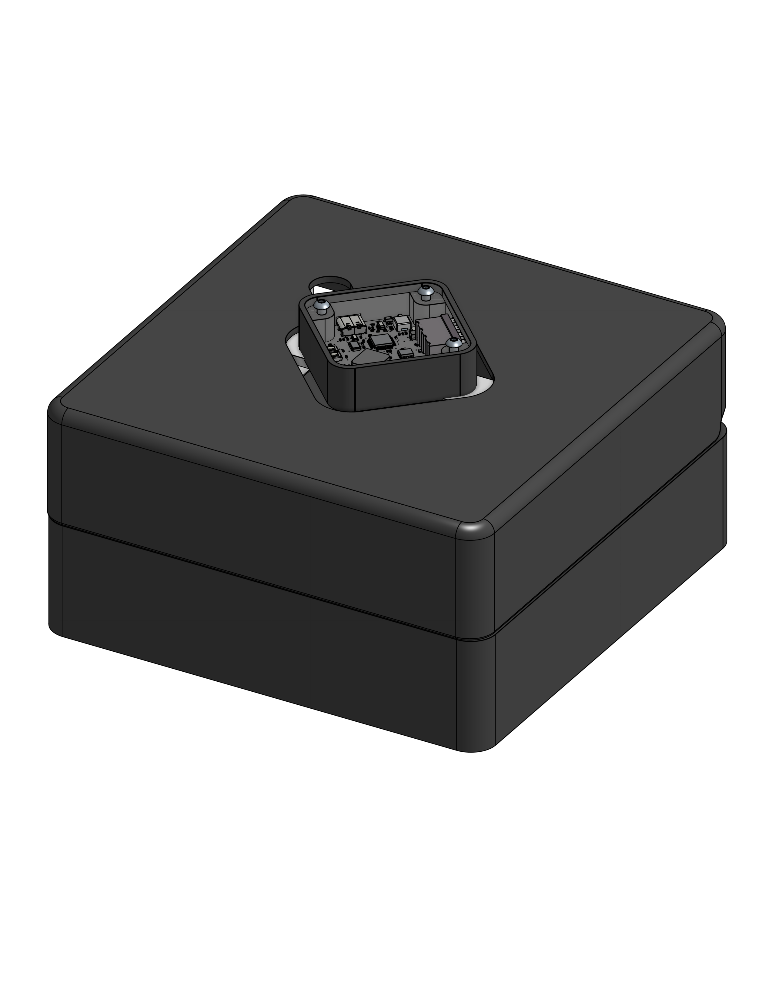

# openbot

openbot is the mobile robot prototype for [opentag one](https://open-tags.com/one/).



- [cad (onshape)](https://cad.onshape.com/documents/432dec42a257744f3b8f22d9/w/829cba9d7a4b997211a6277e/e/69cb96d6d8647e33e3457e0e)
- [step assembly](cad/openbot_assembly.step)
- `firmware/control/` — main xiao esp32-s3 firmware
- `firmware/examples/` — motor and imu bring-up projects
- `software/jetson/` — jetson control ui
- `viewer/` — browser-based 3d assembly viewer

run the viewer from the repository root:

```bash
python3 -m http.server 8000
```

then open <http://localhost:8000/viewer/>.
